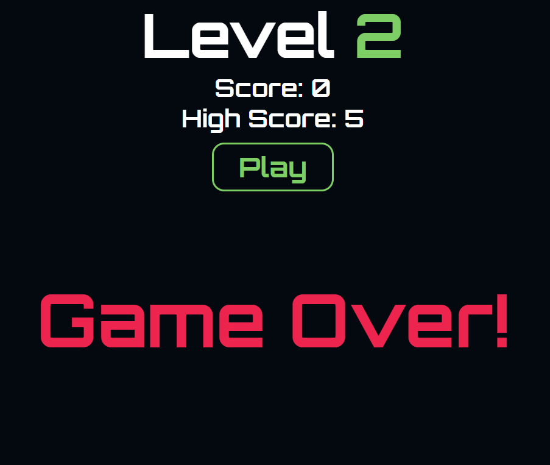

# Snake

## Date: 2/12/2021

### By: Luke Arenas

#### [Website](https://lukearenas.github.io/Personal-Website/) | [GitHub](https://github.com/LukeArenas) | [LinkedIn](https://www.linkedin.com/in/lukearenas/) | [Trello](https://trello.com/b/VDEvoalZ/snake)

### ***Description***

A revamped version of the classic game Snake! This game allows a player to use arrow buttons to control a snake's direction of movement. The snake and the player's score grow as the player successfully guides the snake to the randomly generated food. If the player successfully completes the level, the stakes are raised as the snake begins to move faster and the game board shrinks. Hours of fun!

### **Check out my project** [HERE](http://sulky-tent.surge.sh/)

***

### ***Technologies***

* HTML
* CSS
* JavaScript

***

### ***HTML Decisions***
* Create three html pages with buttons to navigate through them
* index.html will be a welcome page, followed by game.html and secondround.html
* index.html:
  * Create the h1 title element
  * Create a button for the user to navigate to the first round html page
* game.html and secondround.html:
  * Create a main element with a predetermined number of divs (first round has 100, second round 64)
  * Give these divs a class of board and unique numeric ID for JS navigation
  * Create h1 title element and score and high score elements and set their initial values
  * Create a play button so the user can begin the game
  * Embed audio element when play buttons are clicked to add to user experience and overall theme

### ***CSS Decisions***
* Use a gif for the main page to make it more dynamic
* Use consistent colors throughout pages (exception: index.html page has a gif background with default color)
* Make buttons reactive when user hovers cursor over them to make them aware they are clickable
* Use retro gaming font to enhance user experience and overall theme
* Create a dark mode and light mode for user preference
* Set snake food styling to retro-themed fruit

### ***JS Decisions***

* Create event listeners for keypresses as well as the play, dark mode, and next level buttons
* Set the W, A, S, and D keys to corresponding functions to move the snake in that direction
* Set up functions that determine the interval at which the snake should 'step' to the next div
* Create an array of objects to hold the snake's 'body'; initialize the snake in the top left corner of the screen
* The snake will always initially be moving to the right until a key is pressed
* Create a function to randomly generate a strawberry at the beginning of the game as well as when one is consumed
* Use a try...catch block to attempt moving the snake to the next div; if an error is thrown (i.e. div doesn't exist above or below the board) end the game
* Use conditional logic to test for left and right edges of the board, as well as if the snake will hit it's own body
* Create functions to update the snake body array as well as the class of the div's (for visual purposes)
* Create a resetGame function to execute whenever a game ends
* Push a new body segment to the end of the array whenever a strawberry is found, as well as updating the score
* Create conditional logic to display a message and advance to the next level once a certain score is met
* Use DOM manipulation to change what is displayed in the main element depending on the outcome of the game

### ***What I Would Do Differently***
I made the decision early on to give each div a numeric value from 0-99. This made coding the movement of the snake difficult as it required intermediate math calculations to figure out where the snake should move next. From my research, I think an easier way to accomplish this would be to use the canvas method.
Additionally, a lot of the code used in the level2.js file is repeated from the script.js file. In the future, I will research how this can be refactored to prevent redundant code.

### ***Screenshots***

#### Here are some screenshots from the game:

***

### ***Future Updates***

- [ ] Additional levels once level 2 is passed
- [ ] Change snake color when food eaten
- [ ] Add additional fruit PNGs and randomly generate one to assign to the food class

***

### ***Credits***

* [FreeCodeCamp](https://www.freecodecamp.org/news/how-to-build-a-snake-game-in-javascript/)
* [Medium.com](https://medium.com/writeabyte/snake-game-5aaeb80a261a)
* [Educative.io](https://www.educative.io/blog/javascript-snake-game-tutorial)
* Audio: [FreeSoundsLibrary.com](https://www.freesoundslibrary.com/)
* GIF: [Miro.Medium.com](https://miro.medium.com/max/1400/1*4635TGUJegt-JC-i94cGJw.gif)
* PNG: [PinClipArt.com](https://www.pinclipart.com/pindetail/bxhmob_grapes-free-on-dumielauxepices-net-transparent-pac-man/)